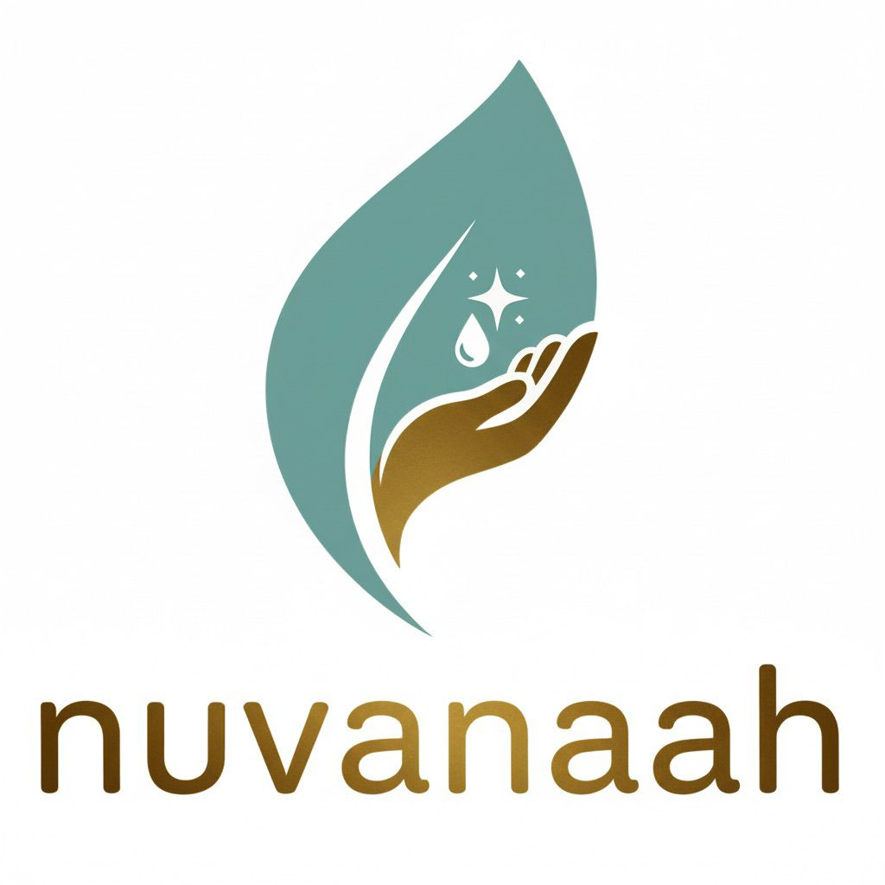

<p align="center">
  
</p>

<h1 align="center">Nuvanaah — Cancer Care Accessories</h1>

<p align="center">
  <em>Empowering confidence through compassionate care products</em>
</p>

<p align="center">
  <a href="#-features">Features</a> •
  <a href="#-tech-stack">Tech Stack</a> •
  <a href="#-getting-started">Getting Started</a> •
  <a href="#-project-structure">Project Structure</a> •
  <a href="#-environment-variables">Environment</a> •
  <a href="#-contributing">Contributing</a>
</p>

---

## 🌸 About

**Nuvanaah** is a premium e-commerce platform offering cancer care accessories — mastectomy bras, chemotherapy accessories, medical-grade wigs, recovery essentials, and lymphedema solutions. Built with empathy at its core, the platform provides a dignified, beautiful shopping experience for cancer warriors and survivors across India.

### Our Mission

> _"Every woman deserves to feel beautiful, confident, and supported — especially during her toughest journey."_

We serve customers across **Mumbai, Delhi, Bangalore, Pune, Chennai, and Kolkata** with curated, medical-grade products and compassionate support.

---

## ✨ Features

### 🛍️ Shopping Experience
- **Product Catalog** — 60+ curated products across medical wigs, mastectomy bras, recovery essentials, accessories, and more
- **Shop by Need** — Surgery-type and condition-based product discovery
- **Smart Search** — Technical name matching (e.g., searching "breast prosthesis" finds the right product)
- **Wishlist & Cart** — Persistent shopping state with drawer UI
- **Product Variants** — Size guides, colour options, and surgery-type filtering

### 🎨 Design & UX
- **Responsive Design** — Mobile-first, optimised for all screen sizes
- **Smooth Animations** — Framer Motion powered transitions and micro-interactions
- **Premium Aesthetic** — Sage green, gold, and cream colour palette reflecting warmth and care
- **Accessible Navigation** — Category browsing, city-specific pages, and FAQ sections

### 📄 Content Pages
- **About Us** — Founder story with brand mission
- **Blog** — Health tips, recovery guides, and product education
- **FAQ** — Comprehensive answers including wig cap sizing guides
- **Consultations** — Free consultation booking flow
- **Legal Pages** — Privacy policy, terms, shipping & returns

### 🔧 Backend & Integrations
- **Supabase** — Authentication & database
- **WooCommerce** — Product catalog management via REST API
- **Razorpay** — Payment gateway (INR)
- **Shiprocket** — Shipping & order tracking
- **SendGrid** — Transactional emails (order confirmation, newsletters)
- **Analytics** — Google Analytics & Meta Pixel ready
- **SEO** — Structured metadata, sitemap generation, robots.txt

---

## 🛠️ Tech Stack

| Layer | Technology |
|-------|-----------|
| **Framework** | [Next.js 16](https://nextjs.org/) (App Router) |
| **Language** | [TypeScript](https://www.typescriptlang.org/) |
| **Styling** | [Tailwind CSS 3](https://tailwindcss.com/) |
| **Animations** | [Framer Motion 12](https://www.framer.com/motion/) |
| **Icons** | [Lucide React](https://lucide.dev/) + [Radix Icons](https://www.radix-ui.com/icons) |
| **UI Utilities** | [clsx](https://github.com/lukeed/clsx) + [tailwind-merge](https://github.com/dcastil/tailwind-merge) + [CVA](https://cva.style/) |
| **Auth & DB** | [Supabase](https://supabase.com/) |
| **Payments** | [Razorpay](https://razorpay.com/) |
| **E-commerce** | [WooCommerce REST API](https://woocommerce.github.io/woocommerce-rest-api-docs/) |
| **Shipping** | [Shiprocket](https://www.shiprocket.in/) |
| **Email** | [SendGrid](https://sendgrid.com/) |

---

## 🚀 Getting Started

### Prerequisites

- **Node.js** 18 or higher
- **npm** (comes with Node.js)
- A `.env.local` file with required environment variables (see [Environment Variables](#-environment-variables))

### Installation

```bash
# Clone the repository
git clone https://github.com/Ananya1464/nuvanaah-website.git
cd nuvanaah-website

# Install dependencies
npm install
```

### Development

```bash
npm run dev
```

Open [http://localhost:3000](http://localhost:3000) to view the app.

### Production Build

```bash
npm run build
npm start
```

### Linting

```bash
npm run lint
```

---

## 📁 Project Structure

```
nuvanaah-website/
├── app/                          # Next.js App Router pages
│   ├── page.tsx                  # Homepage
│   ├── layout.tsx                # Root layout (fonts, metadata, providers)
│   ├── globals.css               # Global styles & Tailwind directives
│   ├── HomePageClient.tsx        # Client-side homepage orchestrator
│   ├── about/                    # About Us page
│   ├── blog/                     # Blog listing & articles
│   ├── cart/                     # Shopping cart page
│   ├── checkout/                 # Checkout flow
│   ├── cities/                   # City-specific landing pages
│   ├── collections/              # Product collections
│   ├── consultations/            # Consultation booking
│   ├── contact/                  # Contact page
│   ├── faq/                      # FAQ with sizing guides
│   ├── gifts/                    # Gift sets & bundles
│   ├── legal/                    # Privacy, Terms, Shipping policies
│   ├── partners/                 # Partner/hospital network
│   ├── products/                 # Product detail pages
│   ├── shop-by-need/             # Surgery-type product discovery
│   ├── account/                  # User account & auth
│   ├── wishlist/                 # Saved items
│   └── api/                      # API routes
│
├── components/
│   ├── homepage/                 # Homepage sections
│   │   ├── Hero.tsx              # Hero banner with CTAs
│   │   ├── HeroAnimated.tsx      # Animated hero variant
│   │   ├── Categories.tsx        # Product category grid
│   │   ├── Testimonials.tsx      # Customer stories
│   │   ├── HowWeHelp.tsx         # Value proposition section
│   │   ├── OurPromise.tsx        # Brand commitment
│   │   ├── Blog.tsx              # Blog preview cards
│   │   ├── Newsletter.tsx        # Email subscription
│   │   ├── Partners.tsx          # Hospital partners
│   │   ├── Footer.tsx            # Site footer
│   │   └── TrustBadges.tsx       # Credibility indicators
│   ├── layout/                   # Header, navigation, layout shells
│   ├── products/                 # Product cards, grids, filters
│   ├── cart/                     # Cart components
│   ├── search/                   # Search functionality
│   ├── ui/                       # Reusable UI primitives
│   ├── animations/               # Animation wrappers
│   ├── CartDrawer.tsx            # Slide-out cart drawer
│   ├── FloatingHelpButton.tsx    # WhatsApp/help floating button
│   └── WhatsAppChat.tsx          # WhatsApp integration
│
├── lib/                          # Utilities & business logic
│   ├── products-data.ts          # Product catalog data
│   ├── product-content.json      # Extended product content
│   ├── cart-context.tsx          # Cart state (React Context)
│   ├── wishlist-context.tsx      # Wishlist state (React Context)
│   ├── auth.ts                   # Authentication helpers
│   ├── woocommerce.ts            # WooCommerce API client
│   ├── inventory.ts              # Stock management
│   ├── orders.ts                 # Order processing
│   ├── email.ts                  # Email templates & sending
│   ├── shiprocket.ts             # Shipping integration
│   ├── security.ts               # Input validation & security
│   ├── analytics.ts              # Event tracking
│   ├── seo.ts                    # SEO metadata helpers
│   ├── sitemap.ts                # Sitemap generation
│   ├── types.ts                  # TypeScript type definitions
│   └── supabase-setup.sql        # Database schema
│
├── public/
│   ├── images/                   # Product & site images
│   ├── logo.jpeg                 # Nuvanaah logo
│   └── robots.txt                # Search engine directives
│
├── tailwind.config.ts            # Tailwind theme customization
├── next.config.js                # Next.js configuration
├── tsconfig.json                 # TypeScript configuration
└── package.json                  # Dependencies & scripts
```

---

## 🔐 Environment Variables

Copy the example file and fill in your credentials:

```bash
cp .env.example .env.local
```

| Variable | Required | Description |
|----------|----------|-------------|
| `NEXT_PUBLIC_WOOCOMMERCE_API_URL` | Yes | WooCommerce REST API endpoint |
| `WOOCOMMERCE_CONSUMER_KEY` | Yes | WooCommerce API key |
| `WOOCOMMERCE_CONSUMER_SECRET` | Yes | WooCommerce API secret |
| `NEXT_PUBLIC_SUPABASE_URL` | Yes | Supabase project URL |
| `NEXT_PUBLIC_SUPABASE_ANON_KEY` | Yes | Supabase anonymous key |
| `NEXT_PUBLIC_RAZORPAY_KEY_ID` | Yes | Razorpay public key |
| `RAZORPAY_KEY_SECRET` | Yes | Razorpay secret key |
| `SENDGRID_API_KEY` | Yes | SendGrid API key for emails |
| `SHIPROCKET_API_KEY` | Yes | Shiprocket shipping API key |
| `NEXT_PUBLIC_GA_MEASUREMENT_ID` | No | Google Analytics 4 ID |
| `NEXT_PUBLIC_META_PIXEL_ID` | No | Meta/Facebook Pixel ID |

> **⚠️ Never commit `.env.local` to version control.** The `.gitignore` already excludes it.

---

## 📊 Current Status

| Area | Status | Notes |
|------|--------|-------|
| Homepage & Design | ✅ Complete | Hero, categories, testimonials, animations |
| Product Catalog | ✅ Complete | 60+ products with technical names, sizing |
| About / Blog / FAQ | ✅ Complete | Content pages with founder story |
| Cart & Wishlist | ✅ Complete | Client-side state management |
| City Landing Pages | ✅ Complete | Mumbai, Delhi, Bangalore, etc. |
| Checkout Flow | 🔧 In Progress | UI built, Razorpay integration pending |
| Authentication | 🔧 In Progress | Supabase schema ready, wiring pending |
| WooCommerce Sync | ⏳ Pending | API client built, shop.nuvanaah.com setup needed |
| Payment Processing | ⏳ Pending | Razorpay keys needed |
| Shipping Integration | ⏳ Pending | Shiprocket API setup needed |
| Product Photography | ⏳ Pending | Real product images needed |

---

## 🤝 Contributing

This is a private project for the Nuvanaah team. To contribute:

1. Create a feature branch from `main`
2. Make your changes
3. Test locally with `npm run dev` and `npm run build`
4. Submit a pull request with a clear description

### Branch Naming

```
feature/short-description
fix/issue-description
content/page-or-section
```

---

## 📞 Contact

**Nuvanaah Cancer Care Accessories**

| Channel | Details |
|---------|---------|
| 🌐 Website | [www.nuvanaah.com](https://www.nuvanaah.com) |
| 📧 Customer Support | care@nuvanaah.com |
| 📧 Order Tracking | shipping@nuvanaah.com |
| 📍 Locations | Mumbai · Delhi · Bangalore · Pune · Chennai · Kolkata |

---

<p align="center">
  <strong>Nuvanaah</strong> © 2024 — Built with 💚 for cancer warriors everywhere
</p>
